# Dancer Flow

<div align="center">

<p align="center">
MZ세대를 타겟으로 <b>짧은 쇼츠 영상</b>을 <b>AI 이미지 처리</b>를 통해</br>
 <b>K-POP 안무를 배우고</b> 게임/경쟁하는 웹 서비스 입니다.</br>
 자이로 센서를 도입한 <b>기존 서비스와는 다르게, AI 기능을 활용</b>하여 </br><b>pose estimation 기능</b>을 이용한 <b>AI 기반 댄스 챌린지 서비스</b>입니다.
</p>
</div>

## 🤹 **Dancer Flow 멤버**

<table>
  <tr>
    <td align="center"><br /><sub><b>안나연</b></sub><br />
    
    
    </td>
    <td align="center"><br /><sub><b>이상준</b></sub><br />
    
    
    </td>
    <td align="center"><br /><sub><b>최호열</b></sub><br />
    
     
    </td>
    <td align="center"><br /><sub><b>조혜정</b></sub><br />
    
    
    </td>
    <td align="center"><br /><sub><b>이기석</b></sub><br />
    
    
    </td>
   
  </tr>
  
</table>
<br/>

## 🖥️ 프로젝트 소개

### 주제 선정 동기 및 이유

- 최근 SNS 등에서 **춤 챌린지 콘텐츠**가 유행하면서,
  일반인들도 **춤에 대한 관심**이 높아졌다.
- **영상 속 춤**과 **내가 추는춤**을 **실시간으로 평가**해
  주는 곳이 없을까?
- **혼자 유튜브 영상**을 보는 걸로는 **춤을 배우기 어렵다**.
- **게임처럼** 즐기면서 **댄스 안무**를 배우고 싶은적이 있으신가요?
  <br/>

따라서 **누구나 쉽게 사용**할수 있고, **AI가 실시간**으로 춤을 추면서 <br/>
**영상속 춤과 맞는지** **피드백**을 해줄수 있는 **웹 서비스**가 필요합니다.


<br/>

### 와이어프레임 및 디자인

<a href="https://www.figma.com/file/mhE3I4SMh33XQUEo3NqF20/Team11?type=design&node-id=0-1&mode=design">피그마 보러가기</a>
<br/>
<br/>

## 📝 DancerFlow 주요 서비스
<a href="https://drive.google.com/file/d/1L867LAbKjUt-0pVEmC9I3hGoqc3Fi_nL/view?usp=sharing">
시연연상
</a>
### 메인 기능

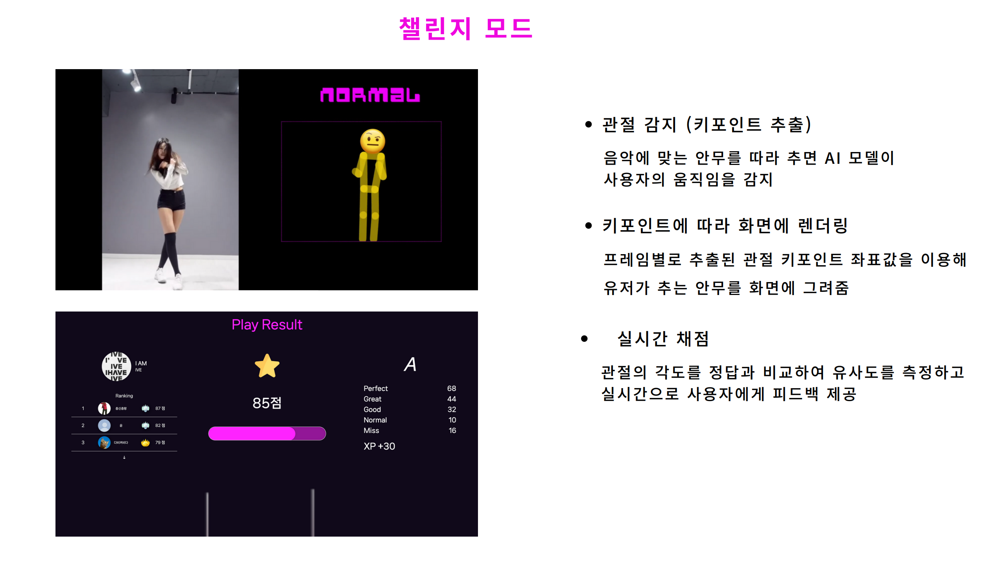
  <br/>
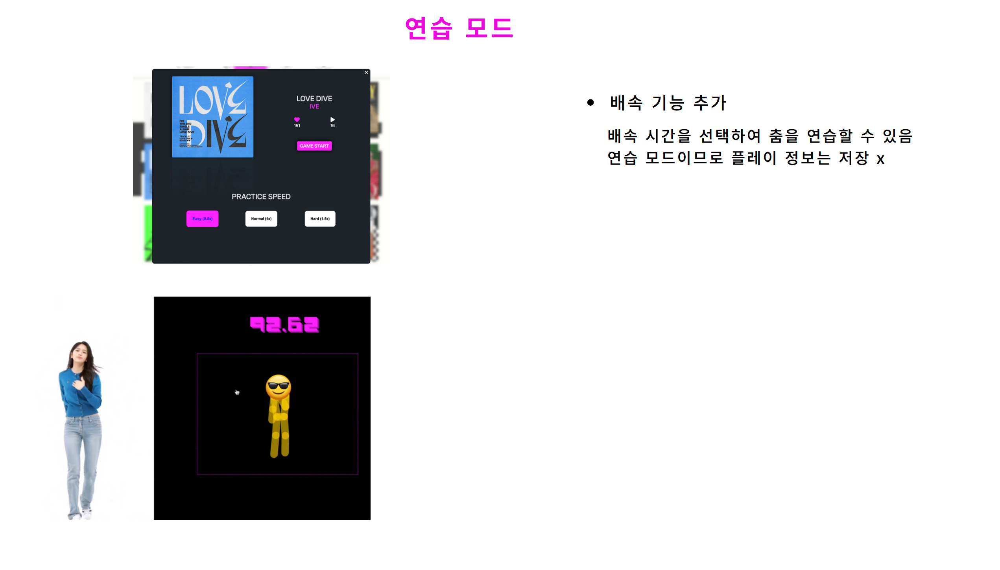
  <br/>
  <br/>

---------------------------------------


### 서브 기능

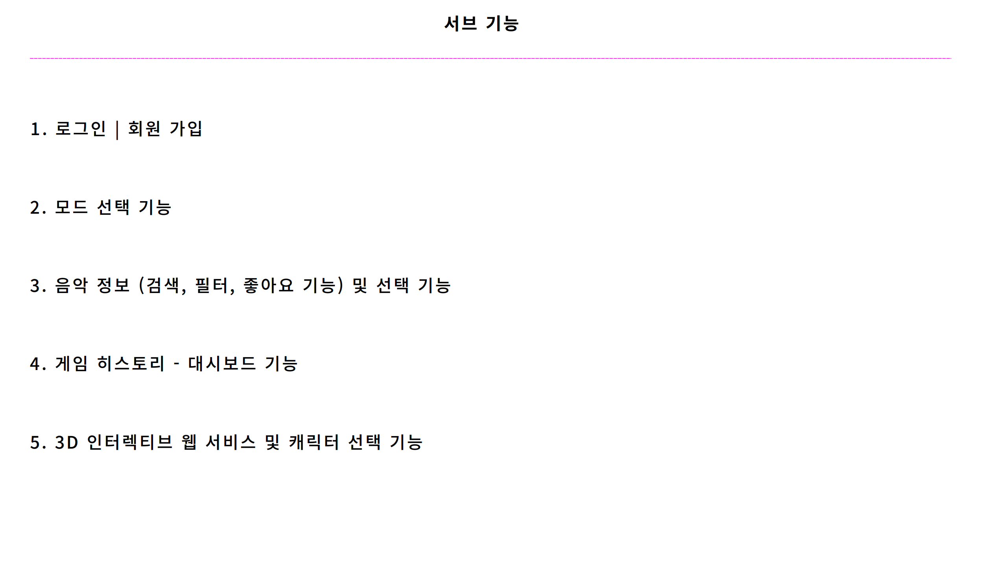
<br/>

#### 노래 선택 및 정보

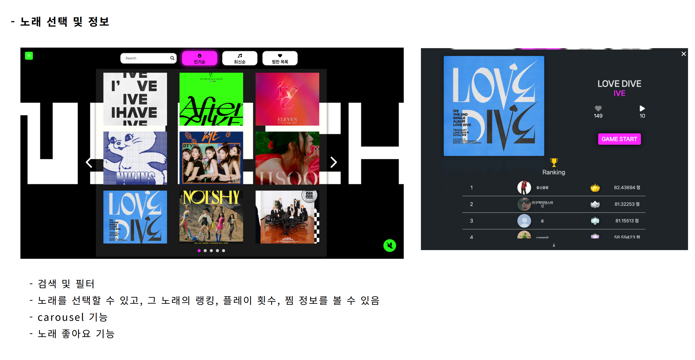
<br/>
---------------------------------------

#### 대시 보드

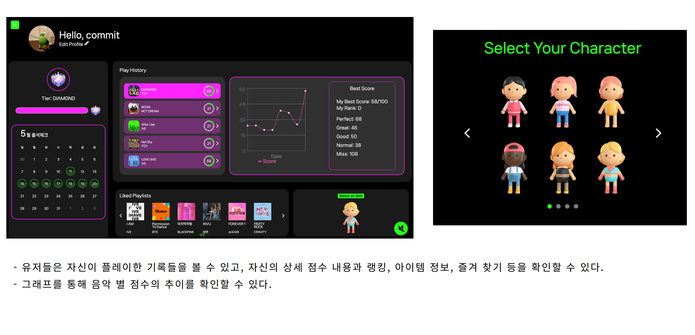
---------------------------------------

#### 게임 모드 선택
<br/>

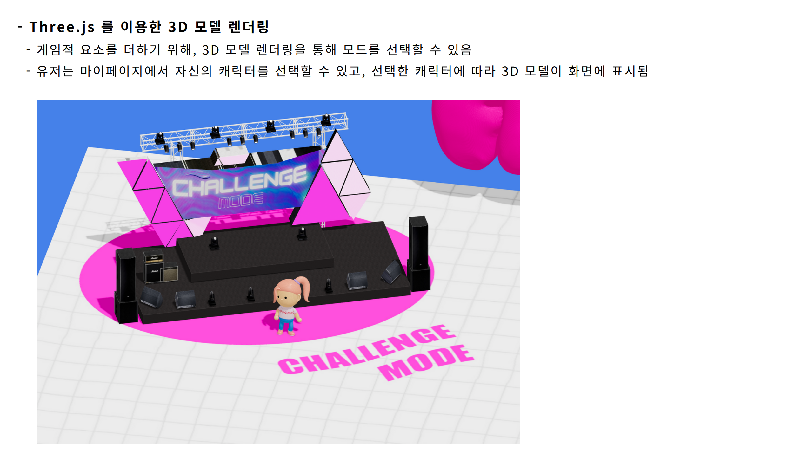
<br/>
<br/>

---------------------------------------


## ⚒️ 기술 스택

### **Common**

  <div>
    
    
  </div>
  <details>
  <summary>
  공통 기술 스택 자세히 보기
  </summary>

<br/>


  <details>
      <summary> Javascript의 한계</summary>
      Javascript는 타입에 제약이 없어 의도치 않은 문제점을 발생시킬 수 있습니다.  
        이러한 문제점은 디버깅을 쉽게 하지 못하게 되고 결국 개발생산성을 저하시키는 요인이 됩니다.
    </details>

  <details>
      <summary>최고의 개발 환경</summary>
      Typescript는 Javascript의 정적버전 언어입니다.동적타입 언어인 Javascript가 가진 단점을 명확한 타입 지정으로 보완이 가능하며,  
     이는 자동완성,타입유추 등 개발자에게 보다 나은 개발환경을 제공해줍니다.
    </details>
    <br/>
       
     <details>
       <summary>Git Flow</summary>

  - Git Flow는 코드의 안정성을 유지하면서도 동시에 여러 버전과 기능을 관리할 수 있게 해주는 강력한 브랜치 관리 전략입니다.
  - 코드의 품질을 향상시키고, 프로젝트 관리를 효과적으로 수행할 수 있습니다.
  <div>
      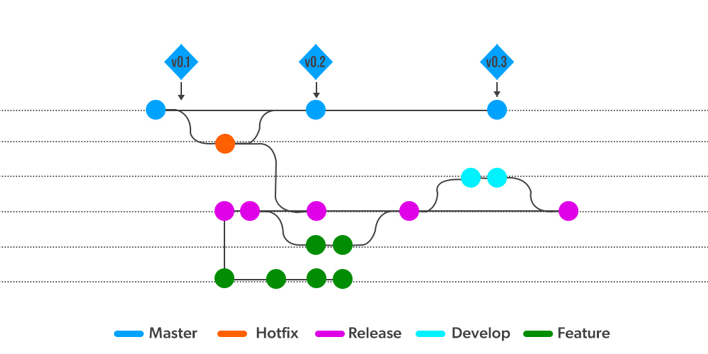
      </div>
  </details>
  </details>

 

<br/>

### **Front-End**

<div>
  
  
  
  
  
 
  
   

</div>
   <details>
     <summary>
     Front-End 기술 스택 자세히 보기
     </summary>
     <br/>

<details><summary>
빠른 cold start, 즉시 업데이트 및 HMR(Hot Module Replacement)을 제공
</summary>

- Vite는 개발 서버가 처음 시작할 때 파일들을 모두 번들링하지 않습니다. 대신, 필요한 파일만 즉시 변환하여 서빙하므로 개발 서버 시작이 빠릅니다.
- 개발시 빠른 반응 속도를 가능하게 하므로, 개발 생산성을 높이는데 큰 도움이 됩니다.
  </details>
       <br/>
       

     <details>
       <summary>보다 편한 비동기 처리</summary>

  - Api 호출을 하는 일련의 과정을 Tanstack-Query에서 제공하는 hook을 통해 편리하게 사용할 수 있습니다.
  </details>
  <details>
  <summary>
  캐싱
  </summary>

  - 한번 처리된 데이터는 queryKey값을 통해 캐싱화 되며 불필요한 api호출을 줄일 수 있습니다.  
    이는 페이지 이동이 잦은 사용자에게 실시간 환경을 제공함으로서 보다 나은 사용자경험을 제공합니다.

</details>

<details>
<summary>강력한 비동기 상태관리</summary>

- Tanstack-Query에서 제공하는 hook 옵션들은 강력한 비동기 상태관리를 가능하게 합니다.  
Suspense에서 관리하는 3가지 상태(pendding,ready,errored)를 react-query에서 직접적으로 접근하여  
isLoading,isFetching,isError,onSuccess,onSettled 등의 옵션으로 간편하게 관리 할 수 있게 해주며,  
이러한 옵션들은 api 호출 시 발생되는 복잡한 다중 이벤트 처리에도 강력한 힘을 발휘합니다.  
또한 전역으로 설정하여 일괄적으로 조건부 처리 또한 가능합니다.
</details>
<br/>


<details><summary>
React에 최적화된 선언적인 리액트 차트 라이브러리
</summary>

- Rechart와 같은 선언적 라이브러리를 사용하면, 개발자는 어떻게 그래프를 그려야 하는지에 대한 복잡한 과정을 걱정할 필요가 없습니다.
- 각 컴포넌트가 어떤 데이터를 사용하고 어떤 모양을 가지길 원하는지만 선언하여 코드의 가독성을 높여줍니다.
</details>
<br/>
 

<details>
<summary>JSON 기반으로 애니메이션을 더 쉽고 효율적으로 제공</summary>

- Lottie 애니메이션은 JSON 파일 형태로 표현되므로, 비트맵 애니메이션(GIF 등)에 비해 크기가 크게 줄어듭니다. 이로 인해 로딩 시간이 줄어들고, 전반적인 웹사이트나 앱 성능이 향상됩니다.
- 사용자의 상호작용에 따라 애니메이션을 변경하거나 반응할 수 있습니다.
- 다양한 플랫폼(iOS, Android, 웹 등)에서 동작하므로, 플랫폼 간에 일관된 애니메이션을 제공할 수 있습니다.

</details>
<br/>


<details>
<summary>
일괄적인 예외 처리
</summary>

- Intercepter를 통해 response,request에 접근하여 일괄적인 예외처리가 가능합니다.
  </details>

<details>
  <summary>
  Parsing
  </summary>

- axios는 자체적으로 response,requset 데이터를 parsing해주어서 fetch보다 간편하게 사용이 가능합니다.

</details>
<br/>


<details>
<summary>효율적인 재사용</summary>

- 한번 선언으로 여러 곳에서 재사용이 가능하며, 필요의 경우 상속을 통해 부가적으로 수정하는 것 또한 가능합니다.
  </details>

   <details>
      <summary>
      조건부 스타일
      </summary>

  - props를 통해 javascript를 이용한 조건부 스타일링은 styled-components의 강력한 기능 중 하나입니다.
   </details>
  <details>
     <summary>
     전역 스타일 관리
     </summary>

  - Theme을 통해 일괄적인 스타일 수정이 가능합니다.
    </details>

<br/>


<details>
<summary>3D 컴퓨터 그래픽을 생성하고 표시하기 위한 크로스-플랫폼 JavaScript 라이브러리</summary>

- 복잡한 3D 애니메이션 및 시각적 효과를 웹사이트에 쉽게 적용할 수 있습니다.

</details>
</details>

<br/>

### **Back-End**

<div>
   
    
    
    
   
   </div>
   <details>
   <summary>
   Back-End 기술 스택 자세히 보기
   </summary>
   <br/>


<details>
    <summary>
TypeScript 기반의 백엔드 프레임워크, 유지 보수성, 확장성
    </summary>

- NestJS는 뛰어난 테스트 지원과 함께 TypeScript의 장점을 제공하므로, 개발 프로세스를 보다 안전하고 효율적으로 만듭니다.
- 그 구조가 Angular와 유사하여 Angular를 사용하는 프론트엔드 개발자가 쉽게 이해할 수 있습니다.

  </details>
<br/>


<details>
    <summary>
안정적이고 확장 가능한 스토리지 서비스
    </summary>

- Amazon S3는 거의 무제한의 스토리지 공간을 제공하며, 사용량에 따라 비용을 지불하므로 비용 효율적입니다.

 </details>

<details>
    <summary>
데이터 백업과 복원이 용이
    </summary>

- 높은 내구성과 99%의 가용성을 제공하여 데이터 손실의 위험을 최소화합니다.
</details>
<br/>
   

<details>
    <summary>
RESTful API를 설계, 빌드, 문서화
    </summary>

- Swagger를 사용하면 API의 명세를 쉽게 작성하고, 그에 따라 클라이언트와 서버의 인터페이스를 자동으로 생성할 수 있습니다.

- 팀원 간의 협업이 용이하고, API의 신뢰성과 품질을 향상시킬 수 있습니다.
  <br/>
     </details>
  <br/>

     

<details>
    <summary>
무상태 인증 및 정보 교환에 우수한 표준
    </summary>

- JWT는 클라이언트와 서버 간의 정보를 JSON 객체 형태로 안전하게 전송하는 데 사용됩니다.
- 이 토큰은 디지털 서명이 되어 있어, 정보의 신뢰성과 보안성을 보장합니다.
  <br/>
     </details>
  <br/>

     

<details>
    <summary>
안정적인 운영
    </summary>

- PM2는 애플리케이션의 로드 밸런싱, 장애 복구, 로그 관리 등을 수행하므로, 애플리케이션의 안정성과 가용성을 높입니다.
</details>
<br/>

</details>
</details>
</details>

</details>
<br/>
  <!-- 백엔드 -->

### **DataBase**

<div>
    
    
       
    </div>
    <details>
    <summary>
    DB 기술 스택 자세히 보기
    </summary>
    <br/>


<details>
  <summary>
다양한 데이터베이스를 지원하는 통합 개발 환경(IDE)

  </summary>

- DataGrip은 코드 자동완성, SQL 검증, 데이터베이스 스키마 관리 등 다양한 기능을 제공합니다.
- 이를 통해 데이터베이스와 작업하는 시간을 줄이고, 오류를 최소화할 수 있습니다.
  </details>

<br/>
 

<details>
  <summary>
    사용하기 쉽고 안정적인 ORM
  </summary>

- Prisma는 SQL 쿼리를 자동으로 생성하고, 타입 안전성을 보장하는 모델을 제공합니다.
- 이로 인해 데이터베이스와의 작업이 간소화되고, 실수를 줄일 수 있습니다.
</details>
<br/>


<details>
  <summary>
안정적인 오픈소스 관계형 데이터베이스
  </summary>

- MySQL은 광범위하게 사용되는 데이터베이스로, 다양한 언어와 플랫폼에서 잘 작동합니다.
- 대용량의 데이터를 안정적으로 처리하고, 트랜잭션 등의 복잡한 작업을 지원합니다.

</details>
<br/>
    </details>
     <br/>

### **AI**

<div>
    
       
    </div>
    <details>
    <summary>
    AI 기술 스택 자세히 보기
    </summary>
    <br/>


<details>
  <summary>
성능이 우수하고 확장성이 높음

  </summary>

- TensorFlow는 높은 수준의 API를 제공하여 복잡한 머신러닝 알고리즘을 손쉽게 구현할 수 있습니다.
- CPU와 GPU를 모두 지원하여 성능을 최적화하고, 다양한 플랫폼에서 사용할 수 있습니다.
  </details>
<details>
  <summary>
Pose Estimation을 위해 MoveNet Thunder 모델을 적용

  </summary>

- TensorFlow는 MoveNet Thunder와 같은 미리 학습된 모델을 활용하여 빠르고 정확한 추론을 가능케 합니다.
- Dancer Flow 서비스는 1명의 동작을 감지하는 서비스이고, 배포 시에 GPU 사용이 불가능하기에 CPU에서도 속도가 빨라야한다.
- top-down 방식은 모든 사람을 감지하고 각각의 포즈를 추정하는 과정이 필요하므로, 처리 속도가 비교적 느립니다.
- bottom-up 방식은 이미지에서 동시에 모든 조인트를 감지하기 때문에 처리 속도가 빠릅니다.

<div>
<p>따라서 1명의 동작을 감지하는 single person 방식과 실시간으로 행동을 감지해야 되기 때문에 속도가 빠른 bottom-up 방식인 MoveNet Thunder 모델을 채택</p>
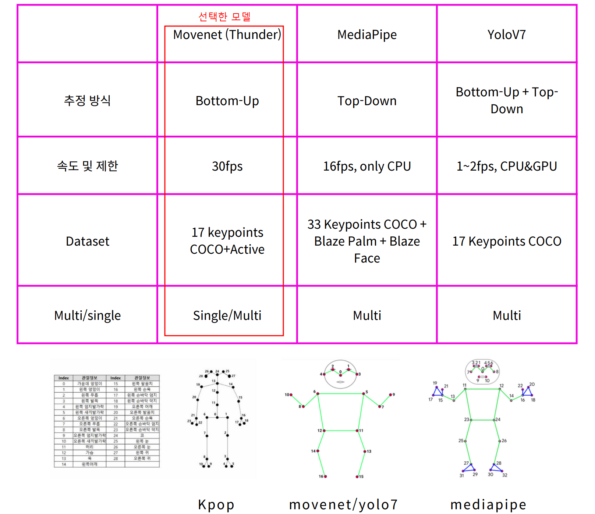
</div>
  </details>

<br/>
 

<details>
  <summary>
    간편한 접근성
  </summary>

- Google Colab은 어디에서나 인터넷을 통해 접근이 가능하며, 별도의 설정이나 설치 없이 주요 머신러닝 라이브러리를 바로 사용할 수 있습니다.

</details>
<details>
  <summary>
    클라우드 기반의 무료 Jupyter 노트북 환경
  </summary>

- 필요에 따라 GPU와 TPU를 무료로 활용할 수 있어, 대규모 데이터를 처리하거나 복잡한 모델을 학습하는 데 적합합니다.
</details>

<br/>
    </details>
     <br/>

<br/>
<br/>

## 🧬 시스템 아키텍쳐

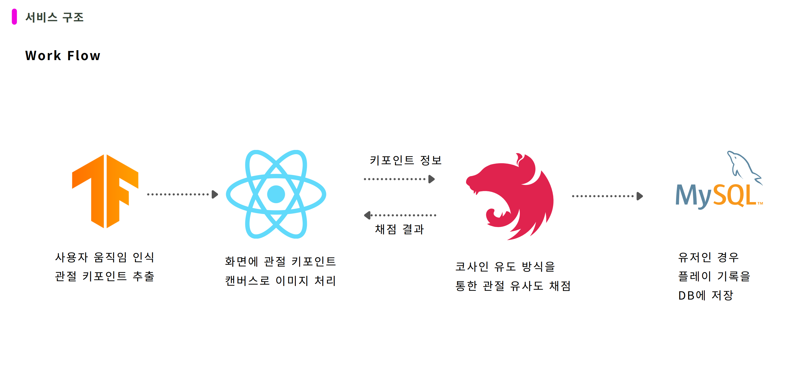
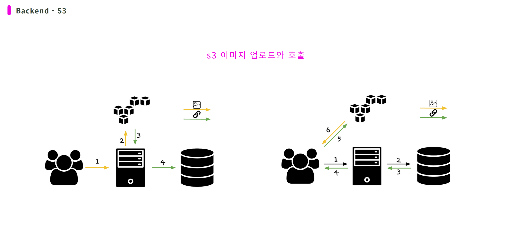
<br/>
<br/>

## 📋 데이터 구조

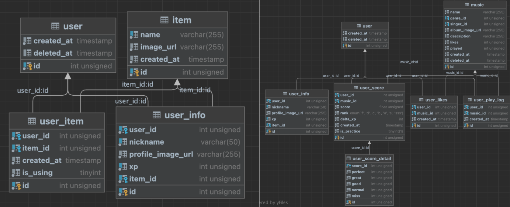
<details>
  <summary>
  데이터 스키마 자세히 확인하기
  </summary>

```prisma
model item {
  id         Int         @id @default(autoincrement()) @db.UnsignedInt
  name       String      @unique(map: "name") @db.VarChar(255)
  image_url  String      @db.VarChar(255)
  created_at DateTime    @default(now()) @db.Timestamp(0)
  user_info  user_info[]
  user_item  user_item[]
}

model music {
  id                 Int                 @id @default(autoincrement()) @db.UnsignedInt
  name               String              @db.VarChar(255)
  genre_id           Int?                @db.UnsignedInt
  singer_id          Int                 @db.UnsignedInt
  album_image_url    String              @default("https://www.google.com/url?sa=i&url=https%3A%2F%2Fgithub.com%2Fscottsweb%2Fnull&psig=AOvVaw3BsOhYVRqYg2iiMss_NVsU&ust=1683609303786000&source=images&cd=vfe&ved=0CBEQjRxqFwoTCPCGp9n75P4CFQAAAAAdAAAAABAJ") @db.VarChar(255)
  description        String?             @db.VarChar(255)
  likes              Int                 @default(0) @db.UnsignedInt
  played             Int                 @default(0) @db.UnsignedInt
  created_at         DateTime            @default(now()) @db.Timestamp(0)
  deleted_at         DateTime?           @db.Timestamp(0)
  music_genre        music_genre?        @relation(fields: [genre_id], references: [id], onDelete: NoAction, onUpdate: NoAction, map: "music_music_genre_id_fk")
  music_singer       music_singer        @relation(fields: [singer_id], references: [id], onDelete: NoAction, onUpdate: NoAction, map: "music_music_singer_id_fk")
  music_answer       music_answer?
  music_answer_sheet music_answer_sheet?
  user_likes         user_likes[]
  user_play_log      user_play_log[]
  user_score         user_score[]

  @@index([genre_id], map: "music_music_genre_id_fk")
  @@index([singer_id], map: "music_music_singer_id_fk")
}

model music_answer {
  id          Int      @id @default(autoincrement()) @db.UnsignedInt
  music_id    Int      @unique(map: "music_id") @db.UnsignedInt
  video_url   String   @db.VarChar(255)
  total_count Int      @db.UnsignedInt
  total_score Int      @db.UnsignedInt
  created_at  DateTime @default(now()) @db.Timestamp(0)
  music       music    @relation(fields: [music_id], references: [id], onDelete: NoAction, onUpdate: NoAction, map: "music_answer_music_id_fk")
}

model music_answer_sheet {
  id         Int      @id @default(autoincrement()) @db.UnsignedInt
  music_id   Int      @unique(map: "music_id") @db.UnsignedInt
  sheet      Json
  created_at DateTime @default(now()) @db.Timestamp(0)
  music      music    @relation(fields: [music_id], references: [id], onDelete: NoAction, onUpdate: NoAction, map: "music_answer_sheet_music_id_fk")

  @@index([music_id], map: "music_answer_sheet_music_id_fk")
}

model music_genre {
  id         Int      @id @default(autoincrement()) @db.UnsignedInt
  name       String   @unique(map: "name") @db.VarChar(255)
  created_at DateTime @default(now()) @db.Timestamp(0)
  music      music[]
}

model music_singer {
  id         Int      @id @default(autoincrement()) @db.UnsignedInt
  name       String   @unique(map: "name") @db.VarChar(255)
  created_at DateTime @default(now()) @db.Timestamp(0)
  music      music[]
}

model tier {
  id            Int             @id @default(autoincrement()) @db.UnsignedInt
  name          tier_name       @unique(map: "name")
  image_url     String?         @db.VarChar(255)
  created_at    DateTime        @default(now()) @db.Timestamp(0)
  user_tier_log user_tier_log[]
}

model user {
  id            Int             @id @default(autoincrement()) @db.UnsignedInt
  created_at    DateTime        @default(now()) @db.Timestamp(0)
  deleted_at    DateTime?       @db.Timestamp(0)
  user_admin    user_admin?
  user_auth     user_auth?
  user_info     user_info?
  user_item     user_item[]
  user_likes    user_likes[]
  user_play_log user_play_log[]
  user_score    user_score[]
  user_tier_log user_tier_log[]
  user_token    user_token?
}

model user_admin {
  id         Int       @id @default(autoincrement()) @db.UnsignedInt
  user_id    Int       @unique(map: "user_id") @db.UnsignedInt
  created_at DateTime  @default(now()) @db.Timestamp(0)
  deleted_at DateTime? @db.Timestamp(0)
  user       user      @relation(fields: [user_id], references: [id], onDelete: NoAction, onUpdate: NoAction, map: "user_admin_user_id_fk")
}

model user_auth {
  id        Int            @id @default(autoincrement()) @db.UnsignedInt
  user_id   Int            @unique(map: "user_id") @db.UnsignedInt
  email     String?        @db.VarChar(320)
  password  String?        @db.VarChar(128)
  social_id String?        @db.VarChar(255)
  type      user_auth_type
  user      user           @relation(fields: [user_id], references: [id], onDelete: NoAction, onUpdate: NoAction, map: "user_auth_user_id_fk")
}

model user_info {
  id                Int    @id @default(autoincrement()) @db.UnsignedInt
  user_id           Int    @unique(map: "user_id") @db.UnsignedInt
  nickname          String @unique(map: "nickname") @db.VarChar(50)
  profile_image_url String @default("https://ai11dancerflow-upload-user-profile-image.s3.ap-northeast-2.amazonaws.com/default.jpg") @db.VarChar(255)
  xp                Int    @default(0) @db.UnsignedInt
  item_id           Int    @default(2) @db.UnsignedInt
  item              item   @relation(fields: [item_id], references: [id], onDelete: NoAction, onUpdate: NoAction, map: "user_info_item__fk")
  user              user   @relation(fields: [user_id], references: [id], onDelete: NoAction, onUpdate: NoAction, map: "user_info_user_id_fk")

  @@index([xp], map: "user_info_tier_id_fk")
  @@index([item_id], map: "user_info_item__fk")
}

model user_item {
  id         Int      @id @default(autoincrement()) @db.UnsignedInt
  user_id    Int      @db.UnsignedInt
  item_id    Int      @db.UnsignedInt
  created_at DateTime @default(now()) @db.Timestamp(0)
  is_using   Int      @db.TinyInt
  item       item     @relation(fields: [item_id], references: [id], onDelete: NoAction, onUpdate: NoAction, map: "user_item_item_id_fk")
  user       user     @relation(fields: [user_id], references: [id], onDelete: NoAction, onUpdate: NoAction, map: "user_item_user_id_fk")

  @@index([item_id], map: "user_item_item_id_fk")
  @@index([user_id], map: "user_item_user_id_fk")
}

model user_likes {
  id         Int      @id @default(autoincrement()) @db.UnsignedInt
  user_id    Int      @db.UnsignedInt
  music_id   Int      @db.UnsignedInt
  created_at DateTime @default(now()) @db.Timestamp(0)
  music      music    @relation(fields: [music_id], references: [id], onDelete: NoAction, onUpdate: NoAction, map: "user_likes_music_id_fk")
  user       user     @relation(fields: [user_id], references: [id], onDelete: NoAction, onUpdate: NoAction, map: "user_likes_user_id_fk")

  @@index([music_id], map: "user_likes_music_id_fk")
  @@index([user_id], map: "user_likes_user_id_fk")
}

model user_play_log {
  id         Int      @id @default(autoincrement()) @db.UnsignedInt
  user_id    Int      @db.UnsignedInt
  music_id   Int      @db.UnsignedInt
  created_at DateTime @default(now()) @db.Timestamp(0)
  music      music    @relation(fields: [music_id], references: [id], onDelete: NoAction, onUpdate: NoAction, map: "user_play_log_music_id_fk")
  user       user     @relation(fields: [user_id], references: [id], onDelete: NoAction, onUpdate: NoAction, map: "user_play_log_user_id_fk")

  @@index([music_id], map: "user_play_log_music_id_fk")
  @@index([user_id], map: "user_play_log_user_id_fk")
}

model user_score {
  id                Int                @id @default(autoincrement()) @db.UnsignedInt
  user_id           Int                @db.UnsignedInt
  music_id          Int                @db.UnsignedInt
  score             Float              @db.Float
  rank              user_score_rank
  delta_xp          Int                @default(0)
  created_at        DateTime           @default(now()) @db.Timestamp(0)
  is_practice       Boolean            @default(false)
  music             music              @relation(fields: [music_id], references: [id], onDelete: NoAction, onUpdate: NoAction, map: "user_score_music_id_fk")
  user              user               @relation(fields: [user_id], references: [id], onDelete: NoAction, onUpdate: NoAction, map: "user_score_user_id_fk")
  user_score_detail user_score_detail?

  @@index([music_id], map: "user_score_music_id_fk")
  @@index([user_id], map: "user_score_user_id_fk")
}

model user_score_detail {
  id         Int        @id @default(autoincrement()) @db.UnsignedInt
  score_id   Int        @unique(map: "score_id") @db.UnsignedInt
  perfect    Int        @default(0) @db.UnsignedInt
  great      Int        @default(0) @db.UnsignedInt
  good       Int        @default(0) @db.UnsignedInt
  normal     Int        @default(0) @db.UnsignedInt
  miss       Int        @default(0) @db.UnsignedInt
  user_score user_score @relation(fields: [score_id], references: [id], onDelete: NoAction, onUpdate: NoAction, map: "user_score_detail_user_score_id_fk")
}

model user_token {
  id            Int      @id @default(autoincrement()) @db.UnsignedInt
  user_id       Int      @unique(map: "user_id") @db.UnsignedInt
  refresh_token String   @unique(map: "refresh_token") @db.VarChar(255)
  expired_at    DateTime @db.Timestamp(0)
  created_at    DateTime @default(now()) @db.Timestamp(0)
  user          user     @relation(fields: [user_id], references: [id], onDelete: NoAction, onUpdate: NoAction, map: "token_user_id_fk")
}

model user_tier_log {
  id         Int      @id @default(autoincrement()) @db.UnsignedInt
  user_id    Int      @db.UnsignedInt
  tier_id    Int      @db.UnsignedInt
  created_at DateTime @default(now()) @db.Timestamp(0)
  tier       tier     @relation(fields: [tier_id], references: [id], onDelete: NoAction, onUpdate: NoAction, map: "user_tier_log_tier_id_fk")
  user       user     @relation(fields: [user_id], references: [id], onDelete: NoAction, onUpdate: NoAction, map: "user_tier_log_user_id_fk")

  @@index([tier_id], map: "user_tier_tier_id_fk")
  @@index([user_id], map: "user_tier_user_id_fk")
}

enum user_auth_type {
  email
  google
  apple
  naver
  kakao
}

enum tier_name {
  BRONZE
  SILVER
  GOLD
  PLATINUM
  DIAMOND
  UNRANKED
}

enum user_score_rank {
  F
  D
  C
  B
  A
  S
  SSS
}
```

</details>
<br/>
<br/>

## API 문서
<a href="https://docs.google.com/spreadsheets/d/1XZ44r_qsvCw8qEZWu2wg9fJJ1E35r6MLA2YXj1bUuZM/edit?usp=sharing">
API 문서 & 기능 명세서 보러가기
</a>
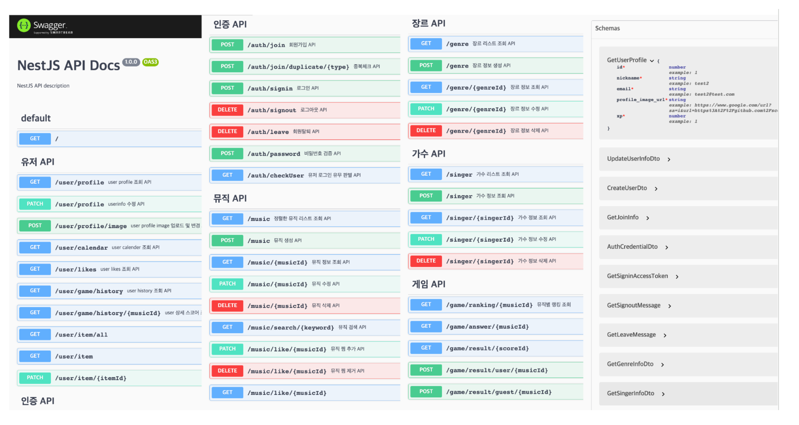
<br/>
<br/>

## 📂 중요 폴더구조

### Frontend

#### src

<details>
  <summary>
  📂api
  </summary>

📦api
┣ 📜authApi.ts
┣ 📜gameApi.ts
┣ 📜musicApi.ts
┣ 📜useDeleteLogoutMutation.ts
┣ 📜useDeleteMusicLikeMutation.ts
┣ 📜useGetGameDataQuery.ts
┣ 📜useGetGameHistoryDetailQuery.ts
┣ 📜useGetGameHistoryQuery.ts
┣ 📜useGetGameResult.ts
┣ 📜useGetGameStamps.ts
┣ 📜useGetMusicDetailQuery.ts
┣ 📜useGetMusicListQuery.ts
┣ 📜useGetMusicRankingQuery.ts
┣ 📜useGetMusicSearchQuery.ts
┣ 📜useGetUserItem.ts
┣ 📜useGetUserLikesQuery.ts
┣ 📜useGetUserProfileQuery.ts
┣ 📜useGetUserVerifyQuery.ts
┣ 📜usePatchMusicLikeMutation.ts
┣ 📜usePatchtUserPasswordMutation.ts
┣ 📜usePostLoginMutation.ts
┣ 📜usePostPlayDataMutation.ts
┗ 📜usePostSignUpMutation.ts

</details>

<details>
  <summary>
  📂assets
  </summary>

📦assets
┣ 📂gameLogo
┃ ┣ 📜countdown.mp4
┃ ┣ 📜dancerflow.mp4
┃ ┗ 📜dancerflow.png
┣ 📂lottie
┃ ┣ 📜good.json
┃ ┣ 📜great.json
┃ ┣ 📜likeBtn.json
┃ ┣ 📜miss.json
┃ ┣ 📜normal.json
┃ ┣ 📜perfect.json
┃ ┣ 📜rankingBanner.json
┃ ┣ 📜star.json
┃ ┣ 📜startBtn.json
┃ ┗ 📜tropy.json
┣ 📂ranks
┃ ┣ 📜bronze.png
┃ ┣ 📜diamond.png
┃ ┣ 📜gold.png
┃ ┣ 📜platinum.png
┃ ┣ 📜prize.png
┃ ┣ 📜silver.png
┃ ┣ 📜star.png
┃ ┗ 📜top_rank.png
┗ 📂user
┃ ┣ 📜profile.jpeg
┃ ┗ 📜smile.svg

</details>

<details>
  <summary>
  📂components
  </summary>
     
 📦components
 ┣ 📂common
 ┃ ┣ 📜DragDrop.tsx
 ┃ ┣ 📜LoadingView.tsx
 ┃ ┣ 📜ModalFrame.tsx
 ┃ ┗ 📜ProgressBar.tsx
 ┣ 📂main
 ┃ ┣ 📜LoginForm.tsx
 ┃ ┣ 📜LoginModal.tsx
 ┃ ┣ 📜SignUpForm.tsx
 ┃ ┣ 📜ThreeIntro.jsx
 ┃ ┗ 📜VideoContainer.tsx
 ┣ 📂musicList
 ┃ ┣ 📂content
 ┃ ┃ ┣ 📜ContentSlide.tsx
 ┃ ┃ ┣ 📜index.tsx
 ┃ ┃ ┣ 📜LikeBtn.tsx
 ┃ ┃ ┣ 📜ModeBackground.tsx
 ┃ ┃ ┣ 📜MusicModal.tsx
 ┃ ┃ ┣ 📜MusicModalContent.tsx
 ┃ ┃ ┣ 📜RankingBanner.tsx
 ┃ ┃ ┣ 📜SpeedSetting.tsx
 ┃ ┃ ┣ 📜StartBtn.tsx
 ┃ ┃ ┣ 📜TopRanking.tsx
 ┃ ┃ ┗ 📜Tropy.tsx
 ┃ ┗ 📂filter
 ┃ ┃ ┗ 📜Filter.tsx
 ┣ 📂result
 ┃ ┣ 📜index.tsx
 ┃ ┣ 📜MusicInfo.tsx
 ┃ ┗ 📜TopRanking.tsx
 ┗ 📂user
 ┃ ┣ 📂main
 ┃ ┃ ┣ 📜index.tsx
 ┃ ┃ ┗ 📜ScoreInfo.tsx
 ┃ ┣ 📜Bottom.tsx
 ┃ ┣ 📜EditModal.tsx
 ┃ ┣ 📜ItemModal.tsx
 ┃ ┗ 📜Profile.tsx
  
</details>

<details>
  <summary>
  📂context
  </summary>
     
 📦context
 ┗ 📜Context.tsx  
  
</details>

<details>
  <summary>
  📂layouts
  </summary>

📦layouts
┣ 📜BgmPlayer.tsx
┣ 📜Navbar.tsx
┣ 📜NavUserInfo.tsx
┗ 📜Rootlayout.tsx

</details>

<details>
  <summary>
  📂pages
  </summary>
     
📦pages
 ┣ 📂adminPage
 ┃ ┗ 📜index.tsx
 ┣ 📂challengePage
 ┃ ┣ 📂Score
 ┃ ┃ ┣ 📜index.tsx
 ┃ ┃ ┗ 📜Score.tsx
 ┃ ┣ 📜Game.tsx
 ┃ ┣ 📜index.tsx
 ┃ ┗ 📜Pose.tsx
 ┣ 📂mainPage
 ┃ ┗ 📜index.tsx
 ┣ 📂modePage
 ┃ ┣ 📂three
 ┃ ┃ ┣ 📂material
 ┃ ┃ ┃ ┣ 📜grid.jpg
 ┃ ┃ ┃ ┗ 📜grid.png
 ┃ ┃ ┣ 📜Background.jsx
 ┃ ┃ ┣ 📜Challenge.jsx
 ┃ ┃ ┣ 📜Construction.jsx
 ┃ ┃ ┣ 📜DanceFloor.jsx
 ┃ ┃ ┣ 📜Floor.jsx
 ┃ ┃ ┣ 📜index.jsx
 ┃ ┃ ┣ 📜Logo.jsx
 ┃ ┃ ┣ 📜Model.jsx
 ┃ ┃ ┣ 📜Player.jsx
 ┃ ┃ ┣ 📜Pointer.jsx
 ┃ ┃ ┣ 📜Practice.jsx
 ┃ ┃ ┗ 📜Room.jsx
 ┃ ┗ 📜index.tsx
 ┣ 📂musicListPage
 ┃ ┗ 📜index.tsx
 ┣ 📂practicePage
 ┃ ┣ 📜Game.tsx
 ┃ ┣ 📜index.tsx
 ┃ ┗ 📜Pose.tsx
 ┣ 📂PracticeResultPage
 ┃ ┗ 📜index.tsx
 ┣ 📂resultPage
 ┃ ┗ 📜index.tsx
 ┣ 📂userPage
 ┃ ┗ 📜index.tsx
 ┗ 📜index.tsx
  
</details>
<details>
  <summary>
  📂utils
  </summary>
     
📦utils
 ┣ 📜tierUtils.tsx
 ┗ 📜validateEmail.ts
  
</details>
<details>
  <summary>
  📂pages
  </summary>
     
📦pages
 ┣ 📂adminPage
 ┃ ┗ 📜index.tsx
 ┣ 📂challengePage
 ┃ ┣ 📂Score
 ┃ ┃ ┣ 📜index.tsx
 ┃ ┃ ┗ 📜Score.tsx
 ┃ ┣ 📜Game.tsx
 ┃ ┣ 📜index.tsx
 ┃ ┗ 📜Pose.tsx
 ┣ 📂mainPage
 ┃ ┗ 📜index.tsx
 ┣ 📂modePage
 ┃ ┣ 📂three
 ┃ ┃ ┣ 📂material
 ┃ ┃ ┃ ┣ 📜grid.jpg
 ┃ ┃ ┃ ┗ 📜grid.png
 ┃ ┃ ┣ 📜Background.jsx
 ┃ ┃ ┣ 📜Challenge.jsx
 ┃ ┃ ┣ 📜Construction.jsx
 ┃ ┃ ┣ 📜DanceFloor.jsx
 ┃ ┃ ┣ 📜Floor.jsx
 ┃ ┃ ┣ 📜index.jsx
 ┃ ┃ ┣ 📜Logo.jsx
 ┃ ┃ ┣ 📜Model.jsx
 ┃ ┃ ┣ 📜Player.jsx
 ┃ ┃ ┣ 📜Pointer.jsx
 ┃ ┃ ┣ 📜Practice.jsx
 ┃ ┃ ┗ 📜Room.jsx
 ┃ ┗ 📜index.tsx
 ┣ 📂musicListPage
 ┃ ┗ 📜index.tsx
 ┣ 📂practicePage
 ┃ ┣ 📜Game.tsx
 ┃ ┣ 📜index.tsx
 ┃ ┗ 📜Pose.tsx
 ┣ 📂PracticeResultPage
 ┃ ┗ 📜index.tsx
 ┣ 📂resultPage
 ┃ ┗ 📜index.tsx
 ┣ 📂userPage
 ┃ ┗ 📜index.tsx
 ┗ 📜index.tsx
  
</details>

### Backend

#### prisma

<details>
  <summary>
  📂prisma
  </summary>
     
  📦prisma
 ┣ 📂migrations
 ┃ ┣ 📂20230505144017_history_init
 ┃ ┃ ┗ 📜migration.sql
 ┃ ┗ 📜migration_lock.toml
 ┗ 📜schema.prisma
  
</details>

#### src

<details>
  <summary>
  📂auth
  </summary>
     
 📦auth
 ┣ 📂dto
 ┃ ┣ 📜authCredential.dto.ts
 ┃ ┗ 📜create-user.dto.ts
 ┣ 📜auth.controller.ts
 ┣ 📜auth.module.ts
 ┗ 📜auth.service.ts
  
</details>
<details>
  <summary>
  📂dto
  </summary>
     
📦dto
 ┣ 📜create-genre.dto.ts
 ┣ 📜create-music.dto.ts
 ┣ 📜create-singer.dto.ts
 ┣ 📜get-game-rank-list.dto.ts
 ┣ 📜get-genre-info.dto.ts
 ┣ 📜get-music-info.dto.ts
 ┣ 📜get-music-list-dto.ts
 ┣ 📜get-singer-info-dto.ts
 ┣ 📜update-genre.dto.ts
 ┣ 📜update-music.dto.ts
 ┗ 📜update-singer.dto.ts
</details>
<details>
  <summary>
  📂game
  </summary>
📦game
 ┣ 📜game.controller.ts
 ┣ 📜game.module.ts
 ┗ 📜game.service.ts
</details>
<details>
  <summary>
  📂middleware
  </summary>
     
 📦middleware
 ┗ 📜jwt.strategy.ts
  
</details>
<details>
  <summary>
  📂music
  </summary>
📦music
 ┣ 📂genre
 ┃ ┣ 📜genre.controller.ts
 ┃ ┣ 📜genre.module.ts
 ┃ ┗ 📜genre.service.ts
 ┣ 📂singer
 ┃ ┣ 📜singer.controller.ts
 ┃ ┣ 📜singer.module.ts
 ┃ ┗ 📜singer.service.ts
 ┣ 📜music.controller.ts
 ┣ 📜music.module.ts
 ┗ 📜music.service.ts
</details>
<details>
  <summary>
  📂prisma
  </summary>
     
📦prisma
 ┣ 📜prisma.module.ts
 ┗ 📜prisma.service.ts
  
</details>
<details>
  <summary>
  📂user
  </summary>
 📦user
 ┣ 📂dto
 ┃ ┗ 📜update-userInfo.dto.ts
 ┣ 📜user.controller.ts
 ┣ 📜user.module.ts
 ┗ 📜user.service.ts
  
</details>
